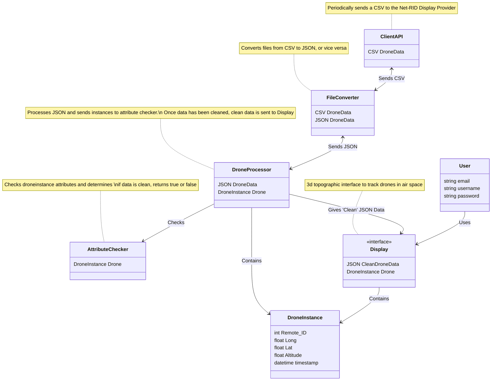

```mermaid
classDiagram
  %% Class relationships
  ClientAPI <--> FileConverter : Sends CSV
  FileConverter <--> DroneProcessor: Sends JSON
  DroneProcessor --> AttributeChecker : Checks
  DroneProcessor --> DroneInstance : Contains
  DroneProcessor --> Display : Gives 'Clean' JSON Data
  Display --> DroneInstance : Contains
  User --> Display : Uses

  %% Class Descriptions
  note for DroneProcessor "Processes JSON and sends instances to attribute checker.\n Once data has been cleaned, clean data is sent to Display"
  note for ClientAPI "Periodically sends a CSV to the Net-RID Display Provider"
  note for AttributeChecker "Checks droneinstance attributes and determines \nif data is clean, returns true or false"
  note for Display "3d topographic interface to track drones in air space"
  note for FileConverter "Converts files from CSV to JSON, or vice versa"

  %% Classes
  class DroneInstance {
    int Remote_ID
    float Long
    float Lat
    float Altitude
    datetime timestamp
  }
  class DroneProcessor {
    JSON DroneData
    DroneInstance Drone
  }
  class ClientAPI {
    CSV DroneData
  }
  class AttributeChecker {
    DroneInstance Drone
  }
  class Display {
    <<interface>>
    JSON CleanDroneData
    DroneInstance Drone
  }
  class User {
    string email
    string username
    string password
  }
  class FileConverter {
    CSV DroneData
    JSON DroneData
  }
```
